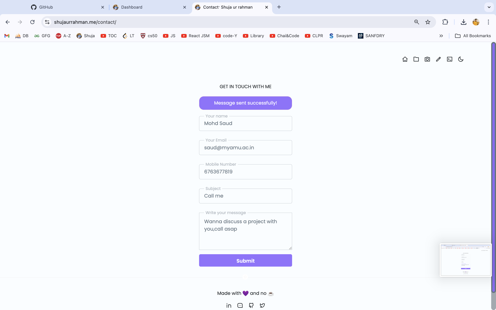
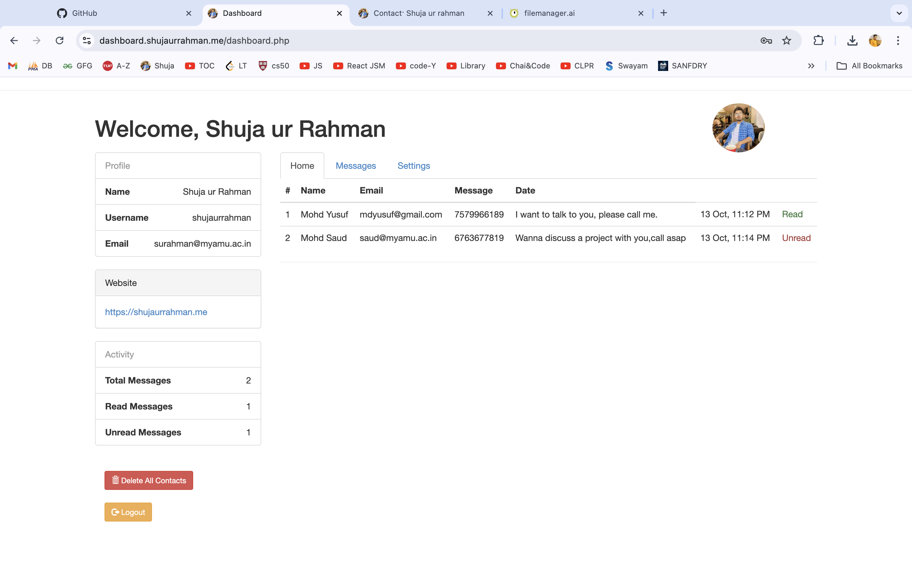
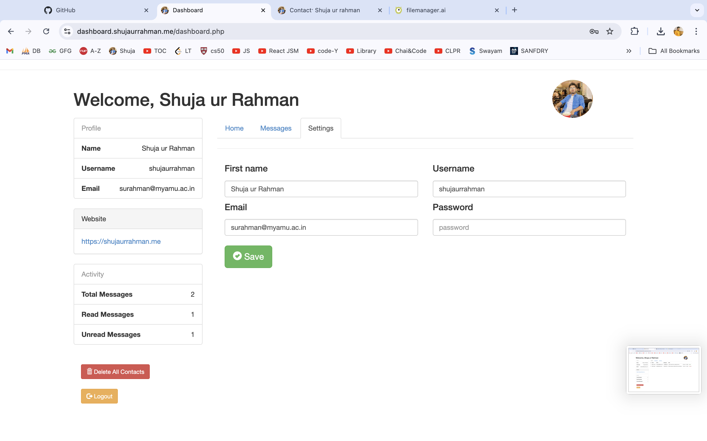

# Central Dashboard for Web Projects

This project serves as the **central administration dashboard** for managing all web projects under the domain **shujaurrahman.me**. It is designed to evolve into a comprehensive management system for future projects, allowing the monitoring, management, and interaction with different websites and their associated functionalities from a single unified interface.

Currently, the project incorporates the **contact form functionality** from **shujaurrahman.me**, where messages or queries submitted via the portfolio website are displayed here for administrative review and action. Future iterations will expand this to include all of my web projects, scaling the system to handle increasing traffic and integrate more features as needed.

## Current Features

- **Contact Form Management**: Administrators can view, manage, and respond to queries submitted through the contact form on **shujaurrahman.me**.
- **Real-time Messaging**: Queries and messages submitted are shown in real-time, making it easy to handle communications promptly.
- **Efficient Query Tracking**: Every message is tracked with important details like name, email, phone number, and message content.

## Images

Here are a few screenshots showcasing the current functionality of the dashboard:

- Overview of the message query system:

  

- Contact form data entry point:

  

- Admin dashboard in action:

  

## Future Plans

In the future, this dashboard will act as the **central hub** for all my web projects. The planned features include:

1. **Multi-project Integration**: Manage and track all web projects (not just **shujaurrahman.me**) from one place.
2. **Scalability**: The dashboard will be scaled to handle increased traffic and queries across all connected projects.
3. **Extended Analytics**: Track user interactions, system health, and performance across various sites in real time.
4. **Advanced Query Management**: Add functionality to categorize, prioritize, and resolve messages from multiple sources.
5. **Security Features**: Implement advanced security and monitoring capabilities to safeguard administrative access.

This dashboard is designed to provide flexibility and control over every web project I develop, offering a unified platform for administrative actions.

## Run the project on your local server

To run this project locally, clone the repository and install the required dependencies.

```bash
git clone <repo-url>
cd project-directory
```

## Contributions

For contributions, feel free to open issues and submit pull requests.


